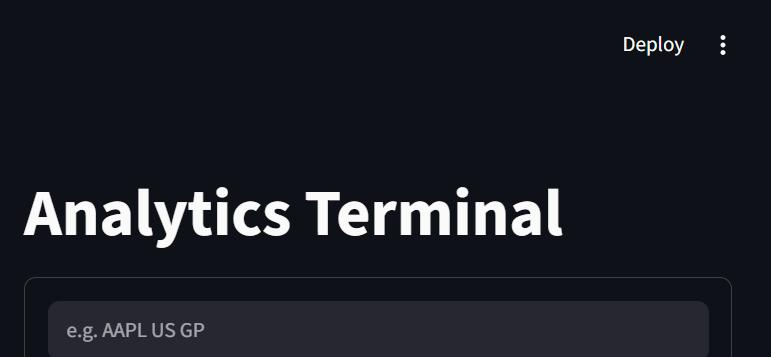
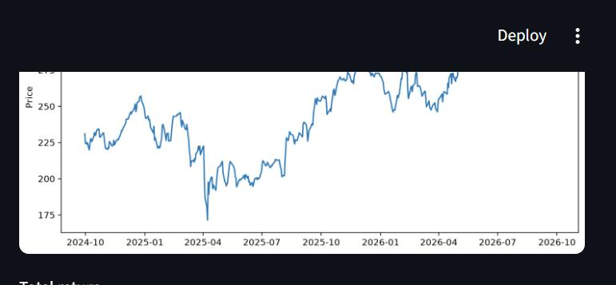
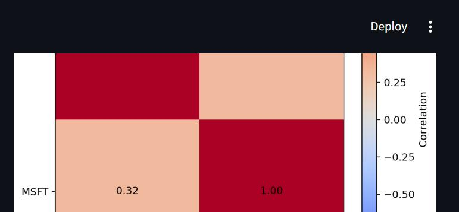
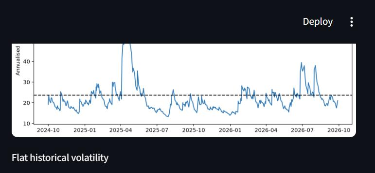

# Analytics Terminal

[](https://github.com/tedaball-jpg/analytics-terminal/actions/workflows/tests.yml)
[](LICENSE)
[](https://www.python.org/)

A Bloomberg-style analytics terminal built with Python and Streamlit, as a learning
project in quantitative finance and software engineering. Type a command like
`AAPL US GP` into a command bar; it's parsed and routed to a function that fetches
real (free) market data, runs a tested calculation, and explains the underlying
finance concept next to the result.

> **This is not Bloomberg.** It imitates the Bloomberg terminal's command-line UX
> (`TICKER MARKET FUNCTION`) as a learning exercise, using only free data sources —
> Yahoo Finance, the UK's Office for National Statistics, the Bank of England, and
> FRED (Federal Reserve Economic Data). It is not affiliated with, endorsed by, or
> connected to Bloomberg L.P. in any way, has no access to real Bloomberg data, and
> should not be used to make real financial decisions. See
> [Known limitations](#known-limitations) for the specifics.

## Screenshots

| Command bar | GP — price chart + statistics |
|---|---|
|  |  |

| PORT — portfolio correlation | PORT — GARCH(1,1) vs flat volatility |
|---|---|
|  |  |

## What it does

Every function follows the same shape: fetch real data → run the calculation through
a small, independently tested pure function → display the result next to a
**Learn panel** that explains the underlying finance concept, common mistakes, and
interview questions with model answers. Nothing on screen is a number typed by hand —
every statistic traces back to a tested function in `analytics.py` or `volatility.py`.

### Functions

There are three command grammars — equity commands need a market to disambiguate a
ticker; macro and portfolio commands don't, so they drop it.

**Equity — `TICKER MARKET FUNCTION`** (e.g. `AAPL US GP`, `AZN LN Equity DES`)

| Function | Name | Output |
|---|---|---|
| `GP` | Graph Price | Price chart over a date range you pick, total/price return, annualised volatility, max drawdown, and an optional rebased comparison against a second security |
| `DES` | Description | Company info table, a 52-week price snapshot, and the business summary |
| `HP` | Historical Price Table | OHLCV data over a date range you pick, with a Change % column, Daily/Weekly/Monthly |

**Macro — `SUBJECT FUNCTION`** (e.g. `UK ECO`, `US GC`, `GBP FXC`)

| Function | Name | Output |
|---|---|---|
| `ECO` | Economic Calendar | Latest CPI, GDP and policy rate readings for `UK` or `US`, with trend charts |
| `GC` | Government Curve | The `US` (5-point, daily) or `UK` (2-point, monthly) yield curve and the 10-year-minus-3-month spread |
| `FXC` | FX Cross Rates | A 4-currency (USD/GBP/EUR/JPY) cross-rate matrix, triangulated through USD |

**Portfolio — `TICKER:WEIGHT,TICKER:WEIGHT,... FUNCTION`** (e.g. `AAPL:0.6,MSFT:0.4 PORT`)

| Function | Name | Output |
|---|---|---|
| `PORT` | Portfolio & Risk Analytics | Cumulative return, volatility, max drawdown, Sharpe ratio, a correlation matrix, per-holding volatility, a GARCH(1,1) fit, and a choice of fixed-weight or buy-and-hold weighting |

Full grammar rules, market codes, and worked examples are in
[Commands](#commands) below.

## Getting started

Works from a clean clone — no API keys or secrets required.

```bash
git clone https://github.com/tedaball-jpg/analytics-terminal.git
cd analytics-terminal
python -m venv .venv
source .venv/bin/activate        # Windows: .venv\Scripts\activate
pip install -r requirements-dev.txt   # requirements.txt + pytest
python -m pytest -v               # 221 tests, no network required
streamlit run app.py              # opens http://localhost:8501
```

If you only want to run the app (not the tests), `pip install -r requirements.txt` is
enough.

## Deployment (Streamlit Community Cloud)

The app has no secrets, no external services beyond free public APIs, and no local
file writes, so it deploys as-is:

1. Push this repo to your own GitHub account (or fork it).
2. On [share.streamlit.io](https://share.streamlit.io), create a new app pointing at
   this repo, branch `main`, main file `app.py`.
3. Streamlit Cloud reads `requirements.txt` automatically. Pick Python 3.12 in the
   advanced settings if asked (that's what this project is tested against).
4. No `secrets.toml` is needed — every function uses public, unauthenticated APIs.

A few things worth knowing before you deploy:

- `matplotlib` is explicitly set to the `Agg` backend in `app.py`, since Streamlit
  Cloud's servers are headless (no display).
- `arch` (the GARCH library) is the heaviest dependency to install and the slowest
  thing to run (1-3 seconds per portfolio fit); Streamlit Cloud's free tier has
  limited CPU, so `PORT` may feel slower there than locally.
- Data is cached with `st.cache_data` (10 minutes to an hour, depending on the
  source), which also reduces load on the free APIs this app depends on.
- `validation/` (see below) is a local-only tool, gitignored, and not part of the
  deployed app.

## Commands

There are two things every command needs to specify: **what** (a ticker, a country/
currency subject, or a weighted basket) and **which function**. The three grammars
below all end with the function code as the *last* word, which is how one parser
supports all three without the caller declaring which grammar it means.

**Equity functions:** `TICKER MARKET FUNCTION` (case-insensitive, extra spaces
ignored). The Bloomberg form with the security type, `TICKER MARKET Equity FUNCTION`,
also works; `Equity` is checked and then dropped, and it is the only security type
accepted.

GP and HP have a **price basis** switch: *dividend-adjusted (total return)*, for
returns, or *split-adjusted only (price return)*, for price levels. Yahoo does not
provide raw, never-adjusted quotes. Both also have a **From/To date picker**,
defaulting to the last 2 years. GP additionally has a **"Compare against"** field: type
a second `TICKER MARKET` and both securities are plotted rebased to 100 at the start
of the window, so they're comparable regardless of price level or currency.

| Market | Meaning |
|---|---|
| `US` | US-listed (no suffix) |
| `LN` | London (`.L` suffix; prices are in pence) |

Examples: `AAPL US GP`, `AZN LN Equity DES`, `AAPL US HP`.

**Macro functions:** `SUBJECT FUNCTION`, no market, no `Equity` word. The subject
universes are deliberately narrow, matching exactly what free data is actually
available: `command_parser.MACRO_SUBJECTS` is the single place that lists what each
macro function accepts (`ECO`: `UK`, `US`; `GC`: `US`, `UK`; `FXC`: `USD`, `GBP`,
`EUR`, `JPY`). US ECO data and the UK/2-year GC points come from FRED (Federal Reserve
Economic Data), which needs no API key.

Examples: `UK ECO`, `US ECO`, `US GC`, `UK GC`, `GBP FXC`.

**Portfolio functions:** `TICKER:WEIGHT,TICKER:WEIGHT,... FUNCTION` (the whole
ticker:weight list is one word, no spaces in it; at least 2 holdings; weights must be
positive but don't need to sum to 1 — they're normalised). Tickers are typed as raw
Yahoo tickers (e.g. `AZN.L` for London), unlike the equity grammar, which hides that
suffix — a basket can mix markets, and there is nowhere to put a market code once you
have several tickers in one word. PORT also has a **Weighting** switch: *fixed weight
(rebalanced daily)* or *buy-and-hold (weights drift)*.

Examples: `AAPL:0.6,MSFT:0.4 PORT`, `AAPL:2,MSFT:1 PORT` (a 2:1 ratio, normalised the
same way).

Do not type `<GO>` in any grammar; it is a key press on the real terminal, not a word
in the command.

## Design: layers

| File | Job |
|---|---|
| [command_parser.py](command_parser.py) | Turns text into a `Command(ticker, market, function, holdings)` or a `ParseError`. Three grammars (equity, macro, portfolio), one function each, picked by which set the function code (always the last word) belongs to. Plain Python, no Streamlit. |
| [market_data.py](market_data.py) | The equity **data layer**: fetching prices (adjusted or split-adjusted, a fixed period or an explicit start/end date) and company info from yfinance, resampling daily rows into weekly/monthly, formatting. No Streamlit. |
| [macro_data.py](macro_data.py) | The macro **data layer**: UK CPI/GDP/Bank Rate from ONS and the Bank of England (moved and refactored from `macro_dashboard.py`); US CPI/GDP/Fed Funds Rate and the UK yield curve from FRED; the US yield curve from yfinance plus a FRED 2-year point. Raises `DataUnavailable` on failure instead of returning `None`; no Streamlit. |
| [analytics.py](analytics.py) | The **calculations**: returns, total return, annualised volatility, drawdown, trailing 52-week range, latest-reading deltas, curve spread/inversion, FX cross-matrix triangulation, weight normalisation, fixed-weight and buy-and-hold portfolio returns, correlation matrix, rebasing, Sharpe ratio, index-level-to-year-over-year-rate conversion. Pure functions on pandas data, no Streamlit or yfinance. |
| [volatility.py](volatility.py) | The **GARCH(1,1) module**: scaling returns for `arch`, the recursion formula, its long-run (steady-state) variance, and `fit_garch()`, which wraps `arch_model(...).fit()`. No Streamlit. |
| [functions.py](functions.py) | Router: a dict mapping function codes to Streamlit handlers (GP, DES, HP, ECO, GC, FXC, PORT), plus the cached download wrappers. Handlers only call the data layer and the calculations, then display, and catch failures into a clean `st.error`/`st.warning`. |
| [app.py](app.py) | Streamlit UI: command bar, calls the parser, shows the error or calls the routed handler. Also where the matplotlib backend is set for headless deployment. |
| [markets.py](markets.py) | Market code to yfinance suffix (`US` -> `""`, `LN` -> `.L`); equity functions only. |
| [portfolio.py](portfolio.py) | Earlier portfolio/volatility script. It now imports `simple_returns`, `annualised_volatility`, `cumulative_return` and `sharpe_ratio` from `analytics.py`, `fit_garch` from `volatility.py`, and `bank_rate_changes`/`fetch_bank_rate_readings` from `macro_data.py` (all used to be untested copies, some via `macro_dashboard.py`). `plot_price_history()`, `plot_correlation_heatmap()` and `plot_garch_vs_flat()` are reused live by GP and PORT; `main()` still saves them as PNGs for the standalone script. |
| [macro_dashboard.py](macro_dashboard.py) | Earlier standalone UK macro script. Now imports its fetch and parse functions from `macro_data.py` instead of defining its own; its own plotting and `main()` are unchanged. |
| [verify_calculations.py](verify_calculations.py) | Independent checks of the equity calculations against live data (see below). |
| [validation/](validation/README.md) | Compares this app's numbers against the real Bloomberg terminal by hand and tracks agreement over time, without ever storing a Bloomberg value in the repo (see below). |

**Why split it:** the parser, both data layers and the calculations have no Streamlit
dependency, so they are unit-tested without a browser. Streamlit code (handlers,
caching, layout, error display) stays in `functions.py` and `app.py`. Each layer has
one job, so changing one doesn't break the others. Numbers are never computed inside a
handler, so every number on screen comes from a tested function. Two standalone
scripts (`portfolio.py`, `macro_dashboard.py`) now import from the shared
data/calculation layers instead of each other or duplicating logic, so there is one
definition of each formula. GARCH got its own module rather than living in
`analytics.py`: it is a different kind of maths (a numerical fit, not a closed-form
formula).

<details>
<summary><strong>Design choices (click to expand — 34 specific decisions and why)</strong></summary>

- **Parser returns a result, not exceptions.** Bad input is normal for a command bar, not exceptional.
- **`FUNCTION_CODES` (in the parser) is the single source of truth for valid codes.** `functions.py` asserts its handler dict has exactly those keys, so the two can't silently drift. (I first had the parser import the handlers, which pulled Streamlit into it, so I flipped the dependency.)
- **Market suffixes are hidden from the user.** Yahoo uses `AAPL` for US stocks but `AZN.L` for London; the terminal takes care of that.
- **GP, DES and HP all fetch through `market_data.py`.** `portfolio.fetch_prices()` (generalised to take `tickers`, `period`, `interval` with defaults) remains for the portfolio script only.
- **Calculations live in `analytics.py`, never in a handler.** Each statistic is a small pure function with hand-worked tests, and `portfolio.py` imports them instead of keeping its own copies.
- **Price basis is an explicit choice.** Returns use dividend-adjusted prices (they include dividends). Price levels (last close, 52-week range) use split-adjusted prices, which are closest to what actually traded. DES uses split-adjusted for its snapshot for that reason.
- **Volatility is annualised by periodicity.** `PERIODS_PER_YEAR` maps Daily/Weekly/Monthly to 252/52/12, and a test fails if a periodicity is added without a factor.
- **`plot_price_history` returns a figure instead of saving a PNG.** Older plot functions save report images; the terminal renders live via `st.pyplot()`, and GP closes each figure so reruns don't accumulate them in memory.
- **HP resampling follows the OHLCV rules.** A week or month's open is its first day's open, high is the highest high, low the lowest low, close the last close, volume the sum. Rows are dated by the last trading day in the period, not the calendar period end, so the current unfinished week or month never shows a future date.
- **DES treats "no company name" as "not found".** For an unknown ticker Yahoo returns a nearly empty record instead of an error, so the app checks for a name.
- **DES does not label market cap with a currency.** Yahoo does not state it (for London stocks the quote currency is pence, but the market cap is clearly not in pence), so guessing would be wrong by a factor of 100. The page says so and points you at the real terminal.
- **Only the fields DES uses are kept from Yahoo's large `info` record**, which keeps the cached data small and the code's dependence on Yahoo's field names explicit.
- **Macro functions use a different grammar (`SUBJECT FUNCTION`) instead of reusing `TICKER MARKET`.** A market code disambiguates an exchange; a country or currency code needs no exchange, so forcing one in would be meaningless (`UK US ECO`?) rather than just unused.
- **Each macro function has its own subject universe (`MACRO_SUBJECTS`), not a shared one.** `GBP` is valid for FXC but not GC; `US` is valid for GC but not ECO. This is realistic (Bloomberg functions vary in what they cover) and it means adding a country later is a one-line change to a dict, not a new code path.
- **`macro_data.py` raises `DataUnavailable` instead of returning `None`.** The functions it replaced (moved from `macro_dashboard.py`) caught exceptions internally and printed to the console, which is invisible in a web app. Handlers now catch the exception and show `st.error`/`st.warning`, the same pattern DES already used for yfinance failures.
- **ECO fetches CPI, GDP and Bank Rate independently, each in its own try/except.** One source being down (ONS, say) shows a warning only for that indicator; the other two still render.
- **GC's chart spaces maturities by actual years, not evenly.** The gap from 3 months to 5 years is genuinely much bigger than 5 to 10 years; spacing the four points evenly would flatten the short end of the curve, which is often where the interesting shape is.
- **FXC triangulates every rate through USD rather than fetching each pair directly.** One consistent data source (`USD<code>=X` for every currency) is simpler to reason about and test than mixing direct-quote conventions, at the cost of a small, expected gap against a directly-quoted pair.
- **PORT is a third grammar, not a variant of the other two.** A basket is a list of an unknown length, which doesn't fit a fixed number of positional words; encoding it in one comma-separated token keeps the "function is always the last word" rule intact.
- **Weights are normalised, not required to sum to 1.** Requiring an exact sum is a common source of a frustrating, avoidable error; dividing by the sum accepts both raw ratios (`2,1`) and pre-normalised fractions (`0.667,0.333`).
- **PORT defaults to fixed weights, rebalanced daily**, with buy-and-hold as an explicit second mode rather than the only option. Fixed-weight is the simpler, more common textbook starting point; offering both, rather than silently picking one, makes the difference between them visible instead of assumed away.
- **`compute_portfolio` is one cached function that fetches and computes, not several small cached steps.** Streamlit's cache can hash a tuple of tickers and weights without needing to decide whether it can also hash a pandas Series or DataFrame as a cache key.
- **GARCH parameters (omega, alpha, beta) are extracted by name from `arch`'s fitted result, not by position.** `arch`'s parameter order isn't part of any promise it makes; the names are.
- **`fit_garch` also returns `mu`, the fitted mean return**, because it's needed to demean returns correctly when reproducing the recursion independently for verification — a byproduct of testing the formula properly, not speculative future-proofing.
- **`end` in a date-range picker is inclusive, even though yfinance's own `end` parameter is exclusive.** A user picking "To: today" expects today's close if one exists; `market_data.fetch_price_history` adds a day internally before calling yfinance, so the UI behaves the way a person reading it would expect, not the way the underlying library happens to work.
- **GP's rebased comparison is a plain widget input (`TICKER MARKET`), not a second full command.** It only needs a ticker and a market, reuses the already-fetched date range and price basis, and doesn't need its own grammar or parser entry for something that's a view option on GP, not a new function.
- **Widening ECO and GC used FRED, discovered by checking, not assuming, that a free source existed.** FRED's plain CSV endpoint needs no API key; this was verified live before any code was written, not taken on faith from the brief.
- **FRED marks a missing observation with an empty string in most series, only sometimes with a documented `.`.** My first implementation only checked for `.`, following FRED's own documentation, and it silently dropped both the new 2-year Treasury point and an entire US CPI reading. Found by actually running the widened fetchers against live data before considering them done, not just running the mocked tests. Both markers are now treated as missing.
- **The UK yield curve is a real, but visibly worse, data source than the US one, and the app says so rather than hiding it.** It's monthly not daily, has 2 points not 5, and its short end is an interbank rate, not a T-bill yield. Showing it as if it matched the US curve's quality would be misleading.
- **US GDP growth (from FRED) is annualised quarter-on-quarter; UK GDP growth (from ONS) is not.** The app does not try to convert one to match the other, since that would need assumptions beyond just unit conversion; it labels each clearly instead and flags the mismatch in the learn file and captions.
- **US CPI's 12-month rate is computed here, not fetched ready-made.** FRED has no ready-made US rate series the way ONS provides for the UK, only the raw index level, so `analytics.year_over_year_change` computes `CPI_t / CPI_(t-12) - 1` from monthly index readings, then the result is rounded to 1 decimal place to match ONS's published precision rather than showing spurious extra digits.
- **PORT's Sharpe ratio uses the US 3-month Treasury yield as the risk-free rate, not the UK Bank Rate the old script used.** The old script's all-UK, FTSE-tracking portfolio made the Bank Rate a sensible default; PORT's basket can be any mix of tickers, so a single, recognisable, currency-agnostic benchmark was chosen over guessing a rate per basket.
- **Buy-and-hold portfolio returns are computed from a value path, not a returns formula applied day by day.** Each holding's value is tracked independently as `weight * cumulative_growth`, summed across holdings, and the return is that path's own day-to-day change — a materially different, more complex calculation than reapplying fixed weights, verified against the fixed-weight version on day one (where they must agree exactly, since no drift has happened yet) and against each holding's own independently-compounded return (which must sum correctly to the portfolio's total), not just spot-checked once.
- **Per-holding volatility needed no new function.** `analytics.annualised_volatility` already works column-wise on a DataFrame (`returns.std()` returns one value per column), so passing the whole returns DataFrame instead of one column gives per-holding volatility directly — reuse, not a new calculation.

</details>

## Testing

**221 tests, no network calls, no flaky external dependencies** — everything that
touches a live API (yfinance, ONS, the Bank of England, FRED) is deliberately kept
outside the pytest suite, in `verify_calculations.py` and `validation/`, which are
separate, manually-run tools. That's what makes the CI workflow
(`.github/workflows/tests.yml`) reliable.

- 41 cases on the parser: valid input, lowercase, messy whitespace, the `Equity` form, wrong word counts, unknown market/function, valid and invalid macro commands (including both subjects now accepted for ECO and GC), each macro function's own subject universe, valid and malformed portfolio commands (bad ratios, non-numeric weights, non-positive weights, duplicate tickers, too few holdings), and each grammar rejecting the other two's style of command.
- 41 cases on the Learn loader: every function must have a valid learn file, and each kind of problem (missing field, blank field, empty list, unknown key, wrong mnemonic, malformed record, bad related mnemonic, missing file, broken YAML) is reported. (Caught several real bugs of exactly this kind while writing learn files, including one more while widening GC's — an unquoted colon in a bullet point silently turned it into a one-key mapping instead of text.)
- 27 cases on `market_data.py`: weekly/monthly aggregation checked by hand against known numbers, holiday weeks dropped, rows dated by last trading day, annualisation factors, percent and market cap formatting, and the company table with missing fields.
- 55 cases on `analytics.py`: returns, total return, volatility (worked out on paper: daily std = 2a/sqrt(3)), compounding vs adding, annualisation factors, drawdown depth and dates, unit-change invariance, trailing range, latest-reading deltas, curve spread/inversion, FX cross-matrix triangulation, weight normalisation, correlation, rebasing (hand-checked, and that two wildly different price levels rebase identically for the same percentage moves), Sharpe ratio (hand-checked, and that it responds correctly to the risk-free rate and to periods_per_year), buy-and-hold portfolio returns (hand-checked day-by-day drift versus the fixed-weight version, and independently checked that the cumulative return equals the weighted sum of each holding's own compounding), and index-level-to-year-over-year-rate conversion (hand-checked, including the 12-reading minimum).
- 14 cases on `volatility.py`: the scaling arithmetic by hand, the GARCH(1,1) recursion by hand (`0.1 + 0.2*4 + 0.7*9 = 7.2`), the long-run variance formula and its boundary case, the recursion converging to the long-run formula under 2000 iterations, and — the strongest check — refitting on a fixed-seed synthetic series and reimplementing the recursion from the fitted parameters, reproducing `arch`'s own conditional volatility to within `1e-8`.
- 16 cases on `macro_data.py`: date parsing by hand, `bank_rate_changes` collapsing a flat run, `DataUnavailable` (not `None`) on a network error or malformed response, FRED CSV parsing (including both of FRED's missing-value markers, found by testing against live data, not just the docs), an unknown GC country rejected, and the US CPI rate's rounding.
- 27 cases on `validation/`: the same difference/agreement-threshold logic used to compare against Bloomberg (see below), plus a guarantee, tested directly, that the generated README summary never contains a value or ticker from the private comparisons file.
- Checked by hand in the browser for every function and every new feature (date-range pickers, the rebased comparison, both GC and ECO subjects, both PORT weighting modes, Sharpe ratio, per-holding volatility), across both markets and multiple error paths (invalid tickers, a broken data source simulated by monkeypatching). Full list of manual checks is in the git history of this file.
- Only pure logic has automated tests; the Streamlit handlers and the panel UI were checked by hand, not automated (no `streamlit` UI test harness is set up).

## How to verify the calculations

Run `python verify_calculations.py` (needs internet). It compares the app's numbers,
computed with pandas, against numbers produced a different way:

| Section | What it does |
|---|---|
| A. Hand-worked example | A 4-price series whose return, volatility and drawdown can be worked out on paper. |
| B. Plain-Python re-implementation | Recomputes total return, compounded return, volatility, max drawdown and the 52-week range with loops and the `math` module only, and rebuilds the weekly table by grouping on ISO weeks (a different rule from pandas' week-ending-Friday). |
| C. Dividend reconciliation | Rebuilds total return from split-adjusted closes plus the dividends actually paid, without touching Yahoo's adjusted series, and compares it with the dividend-adjusted return. |
| D. Properties | Changing units (pounds to pence) must not change any return statistic; drawdown must lie between -100% and 0%. |

It exits with status 1 if any check fails. Latest run: 24 of 24 pass.

What this cannot prove: that Yahoo's prices are correct, or that the conventions (252
trading days, sample standard deviation, simple returns) are the ones you want. Two
manual checks cover that:

1. **Excel:** use the table's built-in "Download as CSV" on `HP`, recompute a return (`=C3/C2-1`) and a volatility (`=STDEV.S(range)*SQRT(252)`), and compare with the app.
2. **Real terminal:** set the same dates and price basis on Bloomberg and compare prices, the 52-week range, and a historical volatility figure. The Learn panel's "Try it on the terminal" checklist lists these steps.

The section below this paragraph is generated by
[validation/validate.py](validation/validate.py)
(`python -m validation.validate report`) and only ever contains counts and agreement
labels, never a value: the real comparisons, including every Bloomberg number, live in
`validation/comparisons.csv`, which is gitignored and never committed. See
[validation/README.md](validation/README.md) for why it's split this way, how to
record a comparison, and
[validation/common_mismatch_causes.md](validation/common_mismatch_causes.md) for a
ranked checklist (price adjustment, date/window alignment, day-count convention, log
vs simple returns, data source, currency/units, rounding) if a number doesn't match.

<!-- VALIDATION:START (generated by validation/validate.py report - do not edit by hand) -->

## Bloomberg validation

No comparisons recorded yet. See [validation/README.md](validation/README.md) to add one after checking a number against the real Bloomberg terminal.

<!-- VALIDATION:END -->

## Learn panel

A toggleable panel beside every function's output that teaches the function: what it
does on the real Bloomberg terminal, why analysts use it, key concepts, how to read
the output, common mistakes, interview questions with model answers, a checklist to
try on the real terminal, and related functions.

The content is **data, not UI code**: one YAML file per function in
[learn/](learn/) (`GP.yaml`, `HP.yaml`, `DES.yaml`, `ECO.yaml`, `GC.yaml`, `FXC.yaml`,
`PORT.yaml`). Adding a function's panel means adding a file; `app.py` never changes.

<details>
<summary><strong>Schema, files, and trade-offs (click to expand)</strong></summary>

| File | Job |
|---|---|
| [learn/*.yaml](learn/GP.yaml) | The content. GP explains adjusted prices, returns, volatility and drawdown; GC explains yield curve shape before the function is described further, since that concept has to be understood before the chart makes sense. |
| [learn_loader.py](learn_loader.py) | Loads a file and validates it (all fields required and non-empty, unknown keys rejected, mnemonic must match the filename). No Streamlit. |
| [learn_panel.py](learn_panel.py) | Renders a loaded file: a scrollable container with expanders for interview questions and checkboxes for the checklist. |
| [test_learn_loader.py](test_learn_loader.py) | Fails if any function in the router has no learn file, or a file is missing or has a blank field. |

Schema (every field required; `related_functions` may be an empty list):

```yaml
mnemonic: GP                 # must equal the filename and the function code
full_name: Graph Price
what_it_does: ...            # text, markdown allowed
why_analysts_use_it: ...
key_concepts: [{term, explanation}, ...]
how_to_read_the_output: [...]
common_mistakes: [...]
interview_questions: [{question, model_answer}, ...]
terminal_checklist: [...]
related_functions: [HP, DES, GIP]   # any well-formed mnemonic; the panel marks which exist here
```

Trade-offs: YAML reads well for prose but is whitespace-sensitive and turns unquoted
`NO`/`ON` into booleans (the validator checks types); strict validation catches typos
but means no stub files; the validator is hand-written to avoid a schema dependency;
`related_functions` isn't checked against built functions so it can point at real
Bloomberg functions not built here.

**The Bloomberg content was written from general knowledge, not from a real Bloomberg
terminal.** Verify each claim with the `terminal_checklist` before relying on it —
this is exactly what `validation/` is for.

</details>

## Known limitations

**The headline one: this app has no relationship to the real Bloomberg terminal.** It
copies the command-bar UX and mnemonic style as a learning exercise. Every number
comes from free public data (Yahoo Finance, ONS, the Bank of England), not a Bloomberg
data feed, and the "Bloomberg validation" section above is empty because I don't have
terminal access to check against — the tool exists and is tested, but hasn't been
exercised with real data yet.

Everything else, grouped by area:

**Data and accuracy**
- Downloads are cached (`st.cache_data`): prices/FX for 10 minutes, company info/UK economic data for an hour, so data can be that stale.
- DES depends on Yahoo's `info` endpoint, which is less reliable than the price download: fields can be missing (shown as `n/a`) and it can be rate-limited.
- GP and HP's date-range picker has no bound other than today; picking a very long window on a rarely-traded ticker can still leave a monthly volatility figure resting on very few observations.
- The UK yield curve (GC) is a genuinely lower-quality free source than the US one: monthly not daily, 2 points not 5, and its short end is an interbank rate, not a T-bill yield. Flagged wherever it appears, not hidden.
- US GDP growth (ECO) is annualised quarter-on-quarter (FRED's convention); UK GDP growth is not (ONS's convention). The app does not convert between them, only labels each.
- FXC's cross rates are triangulated through USD, not fetched directly, so a rate can differ very slightly from a directly-quoted pair.
- FRED's missing-observation marker turned out to be an empty string for most series, not the `.` its documentation emphasises; both are now handled, but a source changing its own convention again would silently reintroduce the same class of bug.

**Portfolio (PORT)**
- Buy-and-hold and fixed-weight give genuinely different numbers for the same basket, especially over longer or more volatile windows; comparing the two without switching modes deliberately is easy to do by accident.
- The Sharpe ratio's risk-free rate is always the US 3-month Treasury yield, regardless of what the basket actually holds - a standard choice, not a tailored one, and said so in the caption rather than presented as exact.
- Needs at least 30 overlapping trading days to run at all, and a GARCH fit on a short or unusual history can be unstable even above that floor (only a stationarity check, `alpha + beta < 1`, guards this — no fit-quality check).
- Tickers are raw Yahoo tickers, so a basket mixing `.L` and bare US tickers mixes two currencies into one correlation matrix without converting them — fine for correlation (a ratio), would be wrong for a currency-mixed total value.
- GARCH fitting is the slowest thing in the app (1-3 seconds); cached, but the first run for a given basket and mode pays that cost.

**Engineering**
- The `assert FUNCTIONS.keys() == FUNCTION_CODES` check crashes the app at import time if the two ever drift; fine for a solo project, not for production.
- Only 2 markets and 7 function codes, hardcoded — extending either is a real, if small, code change, not a config toggle.
- No UI-level automated tests (Streamlit handlers and the Learn panel were checked by hand); only the calculation/parsing/data layers have pytest coverage.
- Streamlit did not always hot-reload changed modules reliably during development; restarting `streamlit run` after editing core modules was sometimes necessary.
- This repo's git history is short (a handful of commits) relative to its size, because it was built in one long, continuous session rather than incrementally over days — the commit log doesn't reflect a typical day-to-day development timeline.

## Concepts worth being able to explain

<details>
<summary>Click to expand — 19 concepts, one line each</summary>

- **Session state:** Streamlit reruns the whole script on every interaction; `st.session_state` remembers the last command.
- **Dataclass:** a lightweight structured record (`Command`) without boilerplate.
- **yfinance MultiIndex columns:** data comes back with columns like `('Close', 'AAPL')`, hence `["Close"]` then the ticker.
- **Invalid tickers:** yfinance returns an empty DataFrame for prices and a nearly empty record for company info, rather than raising, so the app checks `.empty` (prices) and for a missing name (DES).
- **Resampling:** `DataFrame.resample("W-FRI")` groups daily rows into weeks ending Friday and `"ME"` into calendar months; `.agg({...})` then applies a different rule to each column.
- **Adjusted prices:** `auto_adjust=True` rescales history for splits and dividends (use it for returns); `auto_adjust=False` adjusts for splits only (use it for price levels).
- **Total vs price return:** total return includes dividends. On Yahoo's convention the ex-dividend day's growth is `C_t / (C_(t-1) - D_t)`.
- **Annualising volatility:** the daily sample standard deviation times the square root of 252, because variance grows in proportion to time if returns are independent.
- **Maximum drawdown:** the worst fall from a previous peak, `price / running_max - 1`; it captures the worst episode, which volatility does not.
- **Yield curve inversion:** when a shorter maturity yields more than a longer one. It has preceded most US recessions historically, with a lead time that varies widely.
- **Currency triangulation:** deriving a cross rate (GBP/JPY) from two rates against a common anchor currency (GBP/USD and USD/JPY); this is also the mechanism behind triangular arbitrage.
- **Level change vs percentage change:** for a series that is already a percentage (CPI, GDP growth, Bank Rate), a change is reported in percentage points, not a percentage of the previous value.
- **Weight normalisation:** dividing each weight by their sum, so `2,1` and `0.667,0.333` give the same portfolio.
- **Correlation vs diversification:** correlation (-1 to +1) measures how two return series move together; combining assets that are not perfectly correlated can make a portfolio less volatile than the weighted average of its parts.
- **GARCH(1,1):** models variance as `sigma^2_t = omega + alpha*epsilon^2_(t-1) + beta*sigma^2_(t-1)`. `alpha + beta < 1` is required for stationarity; the level it reverts to is `omega / (1 - alpha - beta)`.
- **Rebasing:** rescaling a price series to start at 100 (`price_t / price_0 * 100`) so two securities on different price levels or currencies are directly comparable on one chart.
- **Fixed weight vs buy-and-hold:** fixed weight reapplies the same weights to every day's returns (as if rebalancing daily); buy-and-hold sets weights once and lets them drift as each holding compounds independently. They agree on day one and diverge after.
- **Sharpe ratio:** `(annualised return - risk-free rate) / annualised volatility` — excess return per unit of risk taken, not a return figure on its own.
- **Index level vs a rate:** a CPI *index* (like 334.1) has no meaning alone; the 12-month inflation *rate* is `index_now / index_12_months_ago - 1`. Some sources (ONS) publish the rate directly; others (FRED, for the US) only publish the index, so the rate has to be computed.

</details>

## Repo layout notes

- **`archive/`** — earlier one-off scripts and sample chart outputs, not part of the
  terminal app. See [archive/README.md](archive/README.md).
- **`screenshots/`** — real screenshots of the running app, used above. Not generated
  automatically; retake them after a UI change.
- **`.github/workflows/tests.yml`** — CI: runs the full pytest suite on every push and
  pull request to `main`.

## Next steps

Done in this round: date-range pickers for GP and HP, a rebased two-security
comparison, US ECO and UK GC (plus the US 2-year Treasury point), and PORT's
buy-and-hold mode, Sharpe ratio and per-holding volatility.

Still open: record real comparisons against the Bloomberg terminal in `validation/`
when I next have access to one. A UK 5-year and 30-year GC point, and a UK 2-year
point, if a free source turns up (FRED's OECD mirror only has two UK points today). A
10-year-minus-2-year GC spread alongside the current 10-year-minus-3-month one, now
that the US curve has a 2-year point. A forecast/consensus figure for ECO, so the
"surprise" (actual vs expected) can be shown, not just the actual. A per-holding
Sharpe ratio next to the portfolio-level one.

## License

[MIT](LICENSE) — free to use, copy, modify. See the disclaimer at the top of this
file regarding Bloomberg.
